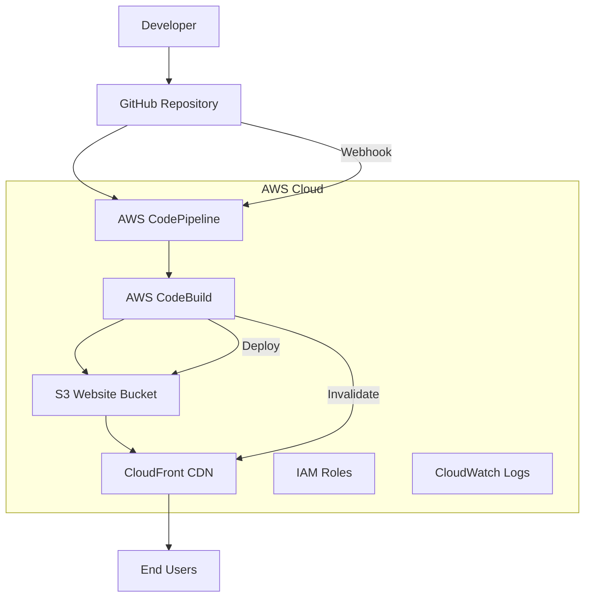

# Cloud-Native Portfolio with AWS CI/CD Pipeline

A professional portfolio website demonstrating modern DevOps practices with automated CI/CD deployment using AWS services.

## 🏗️ Architecture Overview



## 🚀 Features

### Frontend
- **Responsive Design** - Mobile-first, professional portfolio
- **Modern JavaScript** - Smooth scrolling, interactive elements
- **Contact Form** - Integrated with backend API
- **Dynamic Content** - Projects and skills loaded from API

### Backend
- **Node.js/Express API** - RESTful endpoints for portfolio data
- **Contact Form Handler** - Processes contact form submissions
- **Health Checks** - Monitoring endpoints for AWS health checks
- **CORS Enabled** - Cross-origin resource sharing configured

### DevOps & Infrastructure
- **Infrastructure as Code** - CloudFormation templates
- **Automated CI/CD** - Triggered on git push
- **Blue-Green Deployment** - Zero-downtime deployments
- **CDN Distribution** - Global content delivery via CloudFront
- **Monitoring** - CloudWatch logs and metrics

## 🛠️ Technology Stack

- **Frontend**: HTML5, CSS3, Vanilla JavaScript
- **Backend**: Node.js, Express.js
- **Cloud Provider**: AWS
- **CI/CD**: AWS CodePipeline, CodeBuild
- **Hosting**: S3 Static Website + CloudFront
- **Infrastructure**: CloudFormation
- **Version Control**: Git, GitHub

## 📋 Prerequisites

- AWS Account with appropriate permissions
- GitHub account
- AWS CLI configured
- Node.js 18+ installed locally

## 🚀 Local Development

### Frontend Development
```bash
cd frontend
python3 -m http.server 8000
# Visit http://localhost:8000
```

### Backend Development  
```bash
cd backend
npm install
npm start
# API available at http://localhost:3000
```

### Test API Endpoints
```bash
# Health check
curl http://localhost:3000/health

# Get projects
curl http://localhost:3000/api/projects

# Get skills
curl http://localhost:3000/api/skills
```

## ☁️ AWS Deployment

### 1. Deploy Infrastructure
```bash
aws cloudformation deploy \
  --template-file infrastructure/portfolio-infrastructure.yaml \
  --stack-name portfolio-cicd-stack \
  --capabilities CAPABILITY_NAMED_IAM \
  --parameter-overrides ProjectName=portfolio-cicd
```

### 2. Set up GitHub Integration
1. Create GitHub personal access token
2. Store token in AWS Secrets Manager:
```bash
aws secretsmanager create-secret \
  --name github-token \
  --secret-string '{"token":"your-github-token"}'
```

### 3. Automatic Deployment
- Push changes to `main` branch
- CodePipeline automatically triggers
- Website updates within 2-3 minutes

## 📁 Project Structure

```
aws-cicd-web-pipeline/
├── README.md
├── frontend/                    # Portfolio website
│   ├── index.html              # Main HTML file
│   ├── style.css               # Styling
│   └── script.js               # JavaScript functionality
├── backend/                     # API server
│   ├── server.js               # Express server
│   └── package.json            # Dependencies
├── infrastructure/              # AWS Infrastructure
│   ├── portfolio-infrastructure.yaml  # CloudFormation template
│   └── buildspec.yml           # CodeBuild configuration
└── scripts/                     # Deployment scripts
```

## 🔧 AWS Services Used

| Service | Purpose |
|---------|---------|
| **S3** | Static website hosting and artifact storage |
| **CloudFront** | Global CDN for fast content delivery |
| **CodePipeline** | CI/CD orchestration |
| **CodeBuild** | Build and test automation |
| **IAM** | Security and access management |
| **CloudWatch** | Monitoring and logging |
| **Secrets Manager** | Secure credential storage |

## 🔄 CI/CD Pipeline Flow

1. **Source Stage**: CodePipeline detects changes in GitHub
2. **Build Stage**: CodeBuild runs tests and builds application
3. **Deploy Stage**: Files synced to S3, CloudFront cache invalidated
4. **Notification**: Pipeline status updates (optional)

## 📊 Monitoring & Logging

- **Build Logs**: Available in CloudWatch Logs
- **Pipeline Status**: Visible in AWS CodePipeline console
- **Website Metrics**: CloudFront and S3 metrics in CloudWatch
- **Cost Tracking**: AWS Cost Explorer integration

## 🔒 Security Features

- **IAM Roles**: Least privilege access principles
- **HTTPS Only**: CloudFront enforces SSL/TLS
- **Secure Headers**: Security headers implemented
- **Input Validation**: Backend API validates all inputs

## 💰 Cost Optimization

- **S3 Standard-IA**: For infrequently accessed artifacts
- **CloudFront Caching**: Reduces origin requests
- **Build Optimization**: Efficient build processes
- **Resource Cleanup**: Automated cleanup of old artifacts

## 🚦 Pipeline Status


## 🤝 Contributing

1. Fork the repository
2. Create a feature branch (`git checkout -b feature/amazing-feature`)
3. Commit changes (`git commit -m 'Add amazing feature'`)
4. Push to branch (`git push origin feature/amazing-feature`)
5. Open a Pull Request

## 📝 License

This project is licensed under the MIT License - see the [LICENSE](LICENSE) file for details.

## 👨‍💻 Author

**Your Name**
- GitHub: [@credchampion](https://github.com/credchampion)
- LinkedIn: [adeoyeologunmeta-724b57218](https://linkedin.com/in/adeoyeologunmeta-724b57218)
- Email: adeoyeologunmeta@gmail.com
- Portfolio: [Coming Soon - AWS Deployment in Progress]

## 🙏 Acknowledgments

- Built to demonstrate modern DevOps practices
- Showcases AWS cloud-native development
- Implements industry-standard CI/CD patterns
- Thanks to AWS documentation and community

---

⭐ **Star this repository if it helped you learn AWS CI/CD!**